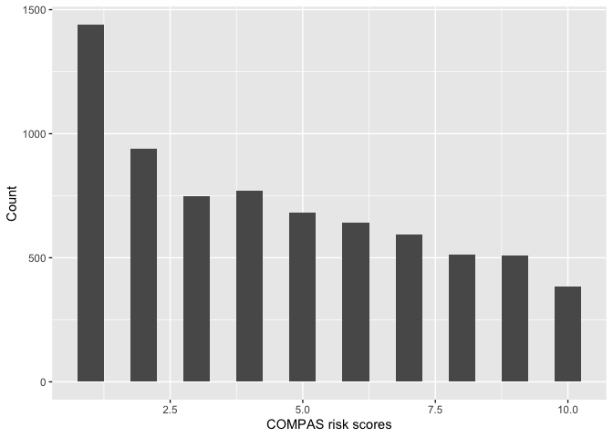
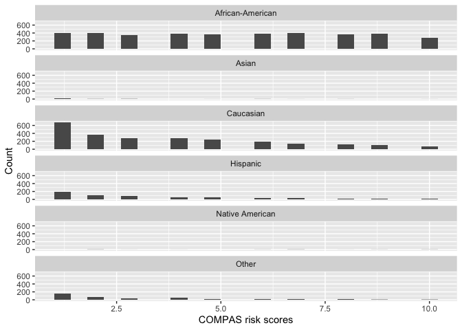
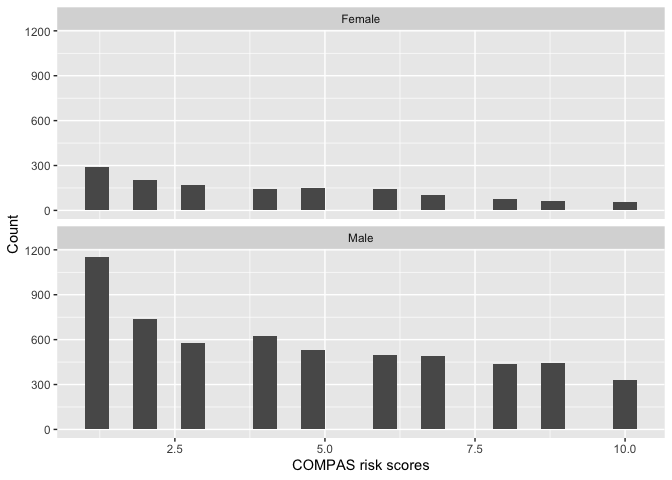
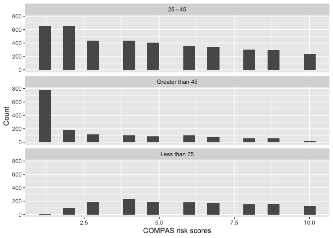
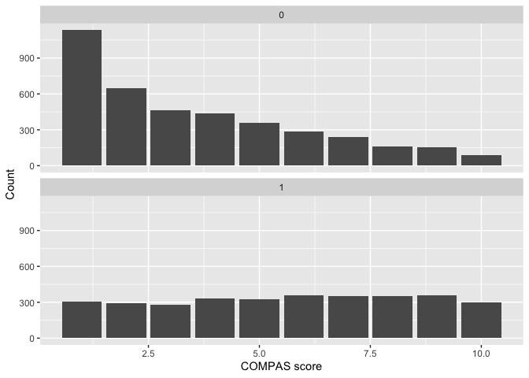
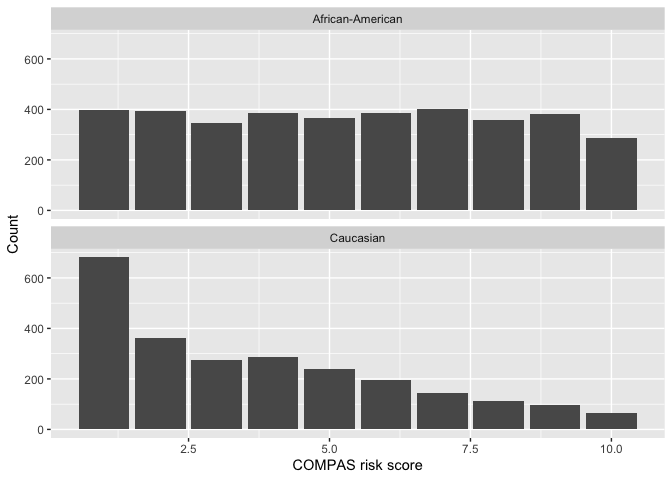
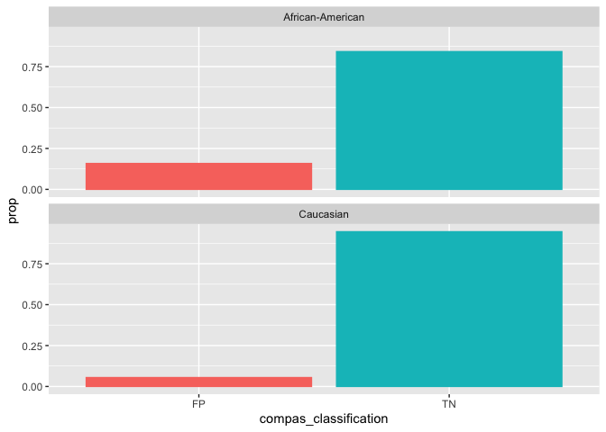
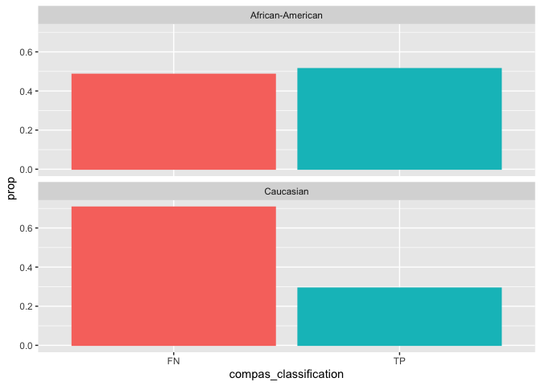
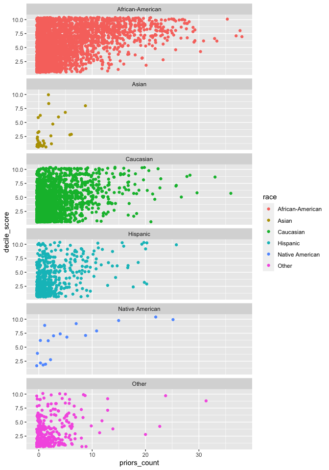

Lab 09: Algorithmic Bias
================
Sophie Boyd
2-27-26

## search I did for exercise 12:

<https://www.google.com/search?q=how+to+restrict+range+of+x+values+in+ggplot2&sca_esv=11f77b5468a41098&rlz=1C5CHFA_enUS912US912&sxsrf=ANbL-n4n0DKV07oSujm7po9TBUMRugrUTA%3A1772208420436&ei=JMGhaarjGb6K6-AP2tTtkQ0&biw=1440&bih=716&oq=how+to+restrict+range+of+x+values+&gs_lp=Egxnd3Mtd2l6LXNlcnAiImhvdyB0byByZXN0cmljdCByYW5nZSBvZiB4IHZhbHVlcyAqAggDMgUQIRigATIFECEYoAEyBRAhGKABMgUQIRigATIFECEYoAEyBRAhGJ8FMgUQIRifBTIFECEYnwUyBRAhGJ8FMgUQIRifBUiYU1DsBljlQnAFeAGQAQCYAZ8BoAHfG6oBBTE5LjE3uAEByAEA-AEBmAIpoAK5HsICChAAGLADGNYEGEfCAgsQABiABBiRAhiKBcICDhAuGIAEGLEDGNEDGMcBwgIKEAAYgAQYQxiKBcICCxAuGIAEGNEDGMcBwgIOEC4YgAQYsQMYgwEYigXCAggQABiABBixA8ICChAuGIAEGEMYigXCAg0QLhiABBhDGOUEGIoFwgIOEAAYgAQYsQMYgwEYigXCAgUQABiABMICBRAuGIAEwgILEAAYgAQYsQMYigXCAggQLhiABBixA8ICCxAAGIAEGLEDGIMBwgIGEAAYFhgewgIFECEYqwLCAgcQIRigARgKmAMAiAYBkAYIkgcFMjAuMjGgB8TJArIHBTE1LjIxuAeQHsIHBjItMzYuNcgHhgKACAA&sclient=gws-wiz-serp>

## Load Packages and Data

First, let’s load the necessary packages:

``` r
library(tidyverse)
library(fairness)
library(janitor)
```

### The data

For this lab, we’ll use the COMPAS dataset compiled by ProPublica. The
data has been preprocessed and cleaned for you. You’ll have to load it
yourself. The dataset is available in the `data` folder, but I’ve
changed the file name from `compas-scores-two-years.csv` to
`compas-scores-2-years.csv`. I’ve done this help you practice debugging
code when you encounter an error.

``` r
compas <- read_csv("data/compas-scores-2-years.csv") %>%
  clean_names() %>%
  rename(
    decile_score = decile_score_12,
    priors_count = priors_count_15
  )
```

### Exercise 1

``` r
nrow(compas)
```

    ## [1] 7214

``` r
ncol(compas)
```

    ## [1] 53

The datset contains 7214 observations of 53 variables. Each row
represents a defendant. The variables provide demographic information
about the defendants and details about their charges, criminal history,
estimated future risk of recidivism, and actual rates of recidivism.

### Exercise 2

As far as I can tell, each row represents a unique defendant. (I could
be missing something!)

### Exercise 3

``` r
compas %>%
  ggplot(aes(x = decile_score)) +
  geom_histogram(binwidth=.5) + 
  labs(x = 'COMPAS risk scores',
       y = 'Count')
```

<!-- --> The
distribution is right-skewed. The majority of the defendants had a low
risk score, and the numbers of defendants with higher scores follow a
downward trend.

### Exercise 4

``` r
compas %>%
  ggplot(aes(x = decile_score)) +
  geom_histogram(binwidth=.4) + 
  labs(x = 'COMPAS risk scores',
       y = 'Count') +
  facet_wrap(~race, nrow = 6) 
```

<!-- -->

``` r
compas %>%
  ggplot(aes(x = decile_score)) +
  geom_histogram(binwidth=.4) + 
  labs(x = 'COMPAS risk scores',
       y = 'Count') +
  facet_wrap(~sex, nrow = 2) 
```

<!-- -->

``` r
compas %>%
  ggplot(aes(x = decile_score)) +
  geom_histogram(binwidth=.4) + 
  labs(x = 'COMPAS risk scores',
       y = 'Count') +
  facet_wrap(~age_cat, nrow = 6) 
```

<!-- -->

### Exercise 5

``` r
compas %>%
  ggplot(aes(x = decile_score)) + 
  geom_bar() +
  facet_wrap(~two_year_recid, nrow=2) +
  labs(x = 'COMPAS score',
       y = 'Count',
       )
```

<!-- -->

Higher risk scores do not correspond to higher rates of recidivism.
Among defendants who did recidivate (the lower plot), there are no
meaningful differences in their COMPAS scores.

### Exercise 6

``` r
compas <- compas %>%
  mutate(compas_classification = case_when(
    decile_score >= 7 & two_year_recid == 1 ~ "TP",
    decile_score <= 7 & two_year_recid == 0 ~ "TN",
    decile_score >= 7 & two_year_recid == 0 ~ "FP",
    decile_score <= 7 & two_year_recid == 1 ~ "FN"
  ))
```

### Exercise 7

``` r
compas %>%
  group_by(compas_classification) %>%
  summarise(n = n()) %>%
  mutate(frequency = n / sum(n)) %>%
  ungroup()
```

    ## # A tibble: 4 × 3
    ##   compas_classification     n frequency
    ##   <chr>                 <int>     <dbl>
    ## 1 FN                     1900    0.263 
    ## 2 FP                      402    0.0557
    ## 3 TN                     3561    0.494 
    ## 4 TP                     1351    0.187

The COMPAS score has a 68% accuracy rate (combined frequencies of true
positives and true negatives).

### Exercise 8

``` r
compas %>%
  filter(race %in% c("African-American", "Caucasian")) %>%
  ggplot(aes(x = decile_score)) + 
  geom_bar() +
  facet_wrap(~race, nrow=2) +
  labs(x = 'COMPAS risk score',
       y = 'Count',
       )
```

<!-- -->

Compared to white defendants, Black defendants are vastly
overrepresented in the high-risk scores.

### Exercise 9

``` r
compas <- compas %>%
  mutate(highrisk = case_when(
    decile_score >= 7 ~ 1,
    decile_score < 7 ~ 0
  ))

compas %>%
  filter(race %in% c("African-American", "Caucasian")) %>%
  group_by(race, highrisk) %>%
  summarise(n = n()) %>%
  mutate(frequency = n / sum(n)) %>%
  ungroup()
```

    ## `summarise()` has grouped output by 'race'. You can override using the
    ## `.groups` argument.

    ## # A tibble: 4 × 4
    ##   race             highrisk     n frequency
    ##   <chr>               <dbl> <int>     <dbl>
    ## 1 African-American        0  2271     0.614
    ## 2 African-American        1  1425     0.386
    ## 3 Caucasian               0  2035     0.829
    ## 4 Caucasian               1   419     0.171

Yes there is a disparity. 38.6% of Black defendants were classified as
high risk, whereas only 17.1% of white participants were classified as
high risk.

### Exercise 10

``` r
non_recidivists <- compas %>%
  filter(two_year_recid == 0) 

non_recidivists %>%
  filter(race %in% c("African-American", "Caucasian")) %>%
  group_by(race, compas_classification) %>%
  summarise(n=n()) %>%
  mutate(frequency = n / sum(n))
```

    ## `summarise()` has grouped output by 'race'. You can override using the
    ## `.groups` argument.

    ## # A tibble: 4 × 4
    ## # Groups:   race [2]
    ##   race             compas_classification     n frequency
    ##   <chr>            <chr>                 <int>     <dbl>
    ## 1 African-American FP                      284    0.158 
    ## 2 African-American TN                     1511    0.842 
    ## 3 Caucasian        FP                       81    0.0544
    ## 4 Caucasian        TN                     1407    0.946

``` r
recidivists <- compas %>%
  filter(two_year_recid == 1) 

recidivists %>%
  filter(race %in% c("African-American", "Caucasian")) %>%
  group_by(race, compas_classification) %>%
  summarise(n=n()) %>%
  mutate(frequency = n / sum(n))
```

    ## `summarise()` has grouped output by 'race'. You can override using the
    ## `.groups` argument.

    ## # A tibble: 4 × 4
    ## # Groups:   race [2]
    ##   race             compas_classification     n frequency
    ##   <chr>            <chr>                 <int>     <dbl>
    ## 1 African-American FN                      923     0.486
    ## 2 African-American TP                      978     0.514
    ## 3 Caucasian        FN                      683     0.707
    ## 4 Caucasian        TP                      283     0.293

### Exercise 11

``` r
non_recidivists%>%
  filter(race %in% c("African-American", "Caucasian")) %>%
  group_by(race, compas_classification) %>%
  summarise(n = n()) %>%
  mutate(prop = n / sum(n)) %>%
  ggplot(aes(x = compas_classification, y = prop, color = compas_classification, fill = compas_classification)) +
  geom_col(show.legend = FALSE) +
  facet_wrap(~race, nrow=2)
```

    ## `summarise()` has grouped output by 'race'. You can override using the
    ## `.groups` argument.

<!-- -->

``` r
recidivists%>%
  filter(race %in% c("African-American", "Caucasian")) %>%
  group_by(race, compas_classification) %>%
  summarise(n = n()) %>%
  mutate(prop = n / sum(n)) %>%
  ggplot(aes(x = compas_classification, y = prop, color = compas_classification, fill = compas_classification)) +
  geom_col(show.legend = FALSE) +
  facet_wrap(~race, nrow=2)
```

    ## `summarise()` has grouped output by 'race'. You can override using the
    ## `.groups` argument.

<!-- -->

Compared to white defendants, Black defendants had a higher false
positive rate and a lower false negative rate, meaning that their
recidivism risk was more likely to be overestimated and less likely to
be underestimated.

### Exercise 12

``` r
compas %>%
  ggplot(aes(x = priors_count, y = decile_score, color = race)) +
  geom_jitter() +
  facet_wrap(~race, nrow = 6)
```

<!-- -->

Priors appear to be most influential on COMPAS scores for Black and
Native American defendants.

### Exercise 13

``` r
compas$decile_cat <- as.factor(compas$decile_score)
  
compas%>%
  group_by(decile_cat, race, is_recid) %>%
  summarise(n = n()) %>%
  mutate(recid_rate = n / sum(n))
```

    ## `summarise()` has grouped output by 'decile_cat', 'race'. You can override
    ## using the `.groups` argument.

    ## # A tibble: 101 × 5
    ## # Groups:   decile_cat, race [56]
    ##    decile_cat race             is_recid     n recid_rate
    ##    <fct>      <chr>               <dbl> <int>      <dbl>
    ##  1 1          African-American        0   298     0.749 
    ##  2 1          African-American        1   100     0.251 
    ##  3 1          Asian                   0    14     0.933 
    ##  4 1          Asian                   1     1     0.0667
    ##  5 1          Caucasian               0   527     0.774 
    ##  6 1          Caucasian               1   154     0.226 
    ##  7 1          Hispanic                0   146     0.745 
    ##  8 1          Hispanic                1    50     0.255 
    ##  9 1          Other                   0   121     0.807 
    ## 10 1          Other                   1    29     0.193 
    ## # ℹ 91 more rows
