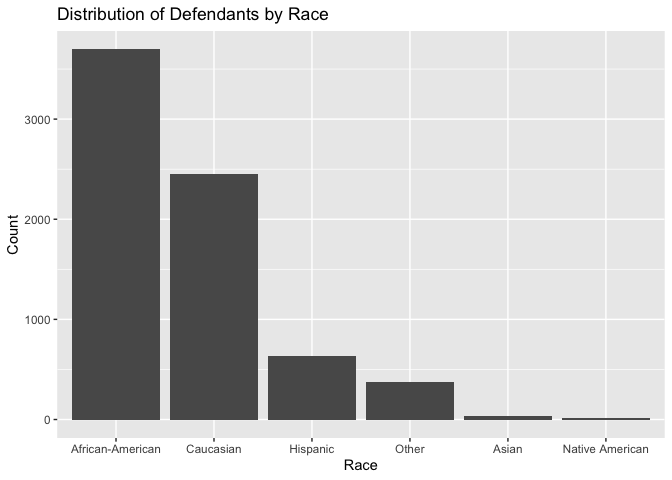
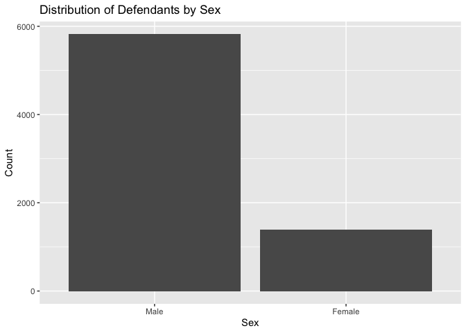

Lab 09: Algorithmic Bias
================
Sophie Boyd
3-2-26

## Load Packages and Data

First, let’s load the necessary packages:

``` r
library(tidyverse)
library(fairness)
library(janitor)
```

### The data

For this lab, we’ll use the COMPAS dataset compiled by ProPublica. The
data has been preprocessed and cleaned for you. You’ll have to load it
yourself. The dataset is available in the `data` folder, but I’ve
changed the file name from `compas-scores-two-years.csv` to
`compas-scores-2-years.csv`. I’ve done this help you practice debugging
code when you encounter an error.

``` r
compas <- read_csv("data/compas-scores-2-years.csv") %>%
  clean_names() %>%
  rename(
    decile_score = decile_score_12,
    priors_count = priors_count_15
  )
```

### Exercise 1

``` r
nrow(compas)
```

    ## [1] 7214

``` r
ncol(compas)
```

    ## [1] 53

The datset contains 7214 observations of 53 variables. Each row
represents a defendant. The variables provide demographic information
about the defendants and details about their charges, criminal history,
estimated future risk of recidivism, and actual rates of recidivism.

### Exercise 2

As far as I can tell, each row represents a unique defendant. (I could
be missing something!)

### Exercise 3

``` r
compas %>%
  ggplot(aes(x = decile_score)) +
  geom_bar() + 
  labs(x = 'COMPAS risk score',
       y = 'Count',
       title = 'Distribution of COMPAS Risk Scores') +
    scale_x_continuous(breaks = seq(1,10, by =1), labels = c("1", "2", "3", "4", "5", "6", "7", "8", "9", "10"))
```

<!-- -->

The distribution is right-skewed. The majority of the defendants had a
low risk score, and the numbers of defendants with higher scores follow
a downward trend.

### Exercise 4

``` r
compas <- compas %>%
  mutate(race_ordered = fct_relevel(race, 'African-American', 'Caucasian', 'Hispanic', 'Other', 'Asian', 'Native American'))

compas %>%
  ggplot(aes(x = race_ordered)) +
  geom_bar() + 
  labs(x = 'Race',
       y = 'Count',
       title = 'Distribution of Defendants by Race') 
```

<!-- -->

``` r
compas <- compas %>%
  mutate(sex_ordered = fct_relevel(sex, 'Male', 'Female'))
  
compas %>%
  ggplot(aes(x = sex_ordered)) +
  geom_bar() + 
  labs(x = 'Sex',
       y = 'Count',
       title = 'Distribution of Defendants by Sex') 
```

<!-- -->

``` r
compas <- compas %>%
  mutate(age_cat_ordered = fct_relevel(age_cat, 'Less than 25', '25 - 45', 'Greater than 45'))

compas %>%
  ggplot(aes(x = age_cat_ordered)) +
  geom_bar() + 
  labs(x = 'Age Category',
       y = 'Count',
       title = 'Distribution of Defendants by Age Category') 
```

<!-- -->

### Exercise 5

``` r
compas <- compas %>%
  mutate(recid_label = case_when(
    two_year_recid == 0 ~ "Did not recidivate",
    two_year_recid == 1 ~ "Recidivated"
  ))

compas %>%
  ggplot(aes(x = decile_score)) + 
  geom_bar() +
  facet_wrap(~recid_label, nrow=2) +
  labs(x = 'COMPAS score',
       y = 'Count',
       ) +
  scale_x_continuous(breaks = seq(1,10, by =1), labels = c("1", "2", "3", "4", "5", "6", "7", "8", "9", "10"))
```

<!-- -->

Higher risk scores do not correspond to higher rates of recidivism.
Among defendants who did recidivate (the lower half of the plot), there
are no meaningful differences in their COMPAS scores.

### Exercise 6

``` r
compas <- compas %>%
  mutate(compas_classification = case_when(
    decile_score >= 7 & two_year_recid == 1 ~ "TP",
    decile_score <= 4 & two_year_recid == 0 ~ "TN",
    decile_score >= 7 & two_year_recid == 0 ~ "FP",
    decile_score <= 4 & two_year_recid == 1 ~ "FN"
  ))
```

### Exercise 7

``` r
compas %>%
  group_by(compas_classification) %>%
  summarise(n = n()) %>%
  mutate(prop = n / sum(n)) %>%
  ungroup()
```

    ## # A tibble: 5 × 3
    ##   compas_classification     n   prop
    ##   <chr>                 <int>  <dbl>
    ## 1 FN                     1216 0.169 
    ## 2 FP                      644 0.0893
    ## 3 TN                     2681 0.372 
    ## 4 TP                     1351 0.187 
    ## 5 <NA>                   1322 0.183

The COMPAS algorithm has a 55% accuracy rate (combined proportions of
true positives and true negatives). This is not good performance- it is
only slightly above chance.

### Exercise 8

``` r
compas %>%
  filter(race %in% c("African-American", "Caucasian")) %>%
  ggplot(aes(x = decile_score)) + 
  geom_bar() +
  facet_wrap(~race, nrow=2) +
  labs(x = 'COMPAS risk score',
       y = 'Count',
       )
```

<!-- -->

Compared to white defendants, Black defendants are vastly
overrepresented in the high-risk scores.

### Exercise 9

``` r
compas <- compas %>%
  mutate(highrisk = case_when(
    decile_score >= 7 ~ 1,
    decile_score < 7 ~ 0
  ))

compas %>%
  filter(race %in% c("African-American", "Caucasian")) %>%
  group_by(race, highrisk) %>%
  summarise(n = n()) %>%
  mutate(frequency = n / sum(n)) %>%
  ungroup()
```

    ## `summarise()` has grouped output by 'race'. You can override using the
    ## `.groups` argument.

    ## # A tibble: 4 × 4
    ##   race             highrisk     n frequency
    ##   <chr>               <dbl> <int>     <dbl>
    ## 1 African-American        0  2271     0.614
    ## 2 African-American        1  1425     0.386
    ## 3 Caucasian               0  2035     0.829
    ## 4 Caucasian               1   419     0.171

Yes, there is a disparity. 38.6% of Black defendants were classified as
high risk, whereas only 17.1% of white participants were classified as
high risk.

### Exercise 10

``` r
non_recidivists <- compas %>%
  filter(two_year_recid == 0) 

non_recidivists %>%
  filter(race %in% c("African-American", "Caucasian")) %>%
  group_by(race, compas_classification) %>%
  summarise(n=n()) %>%
  mutate(prop = n / sum(n))
```

    ## `summarise()` has grouped output by 'race'. You can override using the
    ## `.groups` argument.

    ## # A tibble: 6 × 4
    ## # Groups:   race [2]
    ##   race             compas_classification     n   prop
    ##   <chr>            <chr>                 <int>  <dbl>
    ## 1 African-American FP                      447 0.249 
    ## 2 African-American TN                      990 0.552 
    ## 3 African-American <NA>                    358 0.199 
    ## 4 Caucasian        FP                      136 0.0914
    ## 5 Caucasian        TN                     1139 0.765 
    ## 6 Caucasian        <NA>                    213 0.143

``` r
non_recidivists_prop <- non_recidivists %>%
  filter(race %in% c("African-American", "Caucasian")) %>%
  group_by(race, compas_classification) %>%
  summarise(n=n()) %>%
  mutate(prop = n / sum(n))
```

    ## `summarise()` has grouped output by 'race'. You can override using the
    ## `.groups` argument.

The false positive rate among Black defendants was 24.9%, compared to a
rate of just 9.1% among white defendants.

``` r
recidivists <- compas %>%
  filter(two_year_recid == 1) 

recidivists %>%
  filter(race %in% c("African-American", "Caucasian")) %>%
  group_by(race, compas_classification) %>%
  summarise(n=n()) %>%
  mutate(prop = n / sum(n))
```

    ## `summarise()` has grouped output by 'race'. You can override using the
    ## `.groups` argument.

    ## # A tibble: 6 × 4
    ## # Groups:   race [2]
    ##   race             compas_classification     n  prop
    ##   <chr>            <chr>                 <int> <dbl>
    ## 1 African-American FN                      532 0.280
    ## 2 African-American TP                      978 0.514
    ## 3 African-American <NA>                    391 0.206
    ## 4 Caucasian        FN                      461 0.477
    ## 5 Caucasian        TP                      283 0.293
    ## 6 Caucasian        <NA>                    222 0.230

``` r
recidivists_prop <- recidivists %>%
  filter(race %in% c("African-American", "Caucasian")) %>%
  group_by(race, compas_classification) %>%
  summarise(n=n()) %>%
  mutate(prop = n / sum(n))
```

    ## `summarise()` has grouped output by 'race'. You can override using the
    ## `.groups` argument.

The false negative rate among white defendants (47.7%) was considerably
higher than the false negative rate among Black defendants (28.0%).

### Exercise 11

``` r
non_recidivists_prop%>%
  filter(compas_classification %in% "FP") %>%
  ggplot(aes(x = race, y = prop)) +
  labs(x = 'Race',
       y = 'False Positive Rate') +
  geom_col() 
```

<!-- -->

``` r
recidivists_prop%>%
  filter(compas_classification %in% c("FN")) %>%
  ggplot(aes(x = race, y = prop)) +
  labs(x = 'Race',
       y = 'False Negative Rate') +
  geom_col() 
```

<!-- -->

Compared to white defendants, Black defendants had a higher false
positive rate and a lower false negative rate, meaning that their
recidivism risk was more likely to be overestimated and less likely to
be underestimated.

### Exercise 12

``` r
compas %>%
  ggplot(aes(x = priors_count, y = decile_score, color = race)) +
  geom_jitter(show.legend=FALSE) +
  labs(x = 'Prior Convictions',
       y = 'COMPAS Score') +
  facet_wrap(~race, nrow=3)
```

<!-- -->

Prior convictions appear to be most influential on COMPAS scores for
Black and Native American defendants.

### Exercise 13

``` r
compas$decile_cat <- as.factor(compas$decile_score)
  
compas_recid <- compas %>%
  group_by(decile_cat, race, is_recid) %>%
  summarise(n = n()) %>%
  mutate(recid_rate = n / sum(n))
```

    ## `summarise()` has grouped output by 'decile_cat', 'race'. You can override
    ## using the `.groups` argument.

``` r
compas_recid %>%
  filter(is_recid == 1) %>%
  summarise(decile_cat, race, recid_rate, is_recid)
```

    ## `summarise()` has grouped output by 'decile_cat'. You can override using the
    ## `.groups` argument.

    ## # A tibble: 53 × 4
    ## # Groups:   decile_cat [10]
    ##    decile_cat race             recid_rate is_recid
    ##    <fct>      <chr>                 <dbl>    <dbl>
    ##  1 1          African-American     0.251         1
    ##  2 1          Asian                0.0667        1
    ##  3 1          Caucasian            0.226         1
    ##  4 1          Hispanic             0.255         1
    ##  5 1          Other                0.193         1
    ##  6 2          African-American     0.346         1
    ##  7 2          Caucasian            0.346         1
    ##  8 2          Hispanic             0.336         1
    ##  9 2          Other                0.394         1
    ## 10 3          African-American     0.474         1
    ## # ℹ 43 more rows

I don’t think that the calibration analysis supports Northpointe’s claim
that the algorithm is fair, as recidivism rates still vary considerably
by race among defendants with the same COMPAS score.

### Exercise 14

As a start, I would consider constraining predictors from past criminal
history to be weighed equally across demographic groups (though I
realize this would not be a perfect solution- see exercise \#16).

### Exercise 15

As mentioned in the examples above, defining fairness in terms of false
positive/negative rates versus in terms of calibration can lead to
incompatible interpretations of/adjustments to the system.

### Exercise 16

Because the algorithm calculates risk scores using information about
criminal history/prior charges, it is inherently influenced by
disparities in the criminal justice system (e.g., racial profiling) that
affect who is more likely to be charged with a crime to begin with. An
algorithm that assigns scores based on information from an inequitable
system will produce inequitable outcomes.

------------------------------------------------------------------------

### Sources:

<https://ggplot2.tidyverse.org/articles/faq-axes.html#>:~:text=Dodge%20axis%20labels:%20Add%20a,rows%20to%20render%20the%20labels.

#### exercise 7:

After struggling with this problem for a little while, I searched
something like “how to get the proportion of values within a variable in
r” and got this suggestion from the top line AI summary:

proportions_df \<- df %\>% group_by(category) %\>% summarize(count =
n()) %\>% mutate(proportion = count / sum(count)) \#

print(proportions_df)

The summary included these links as sources:

<https://datavizm20.classes.andrewheiss.com/lesson/04-lesson/#>:~:text=When%20you%20visualize%20proportions%20with%20ggplot%2C%20you’ll,summarize()%20)%20\*%20Plot%20the%20summarized%20data.
<https://collinn.github.io/f24/labs/04_dplyr.html#>:~:text=Whenever%20functions%20from%20the%20dplyr%20package%20see,it%20intends%20to%20at%20the%20group%20level.
<https://www.r-bloggers.com/2024/02/group-by-minimum-in-r/#>:~:text=It%20(%20The%20GROUP%20BY%20clause%20),to%20perform%20these%20operations%20on%20data%20frames.
scaler.com/topics/dplyr-package-in-r/#:~:text=As%20R%20users%20commonly%20work%20with%20data,a%20more%20natural%20workflow%2C%20simplifying%20data-wrangling%20tasks.
